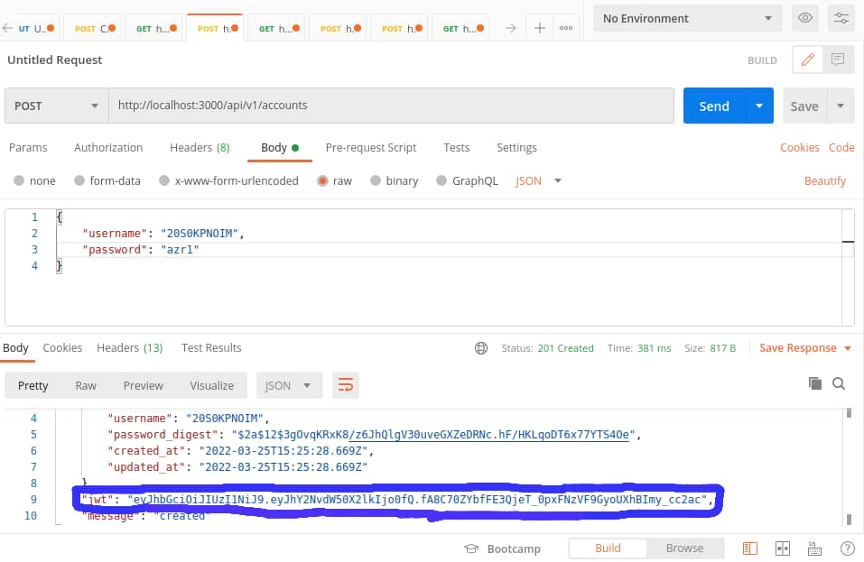
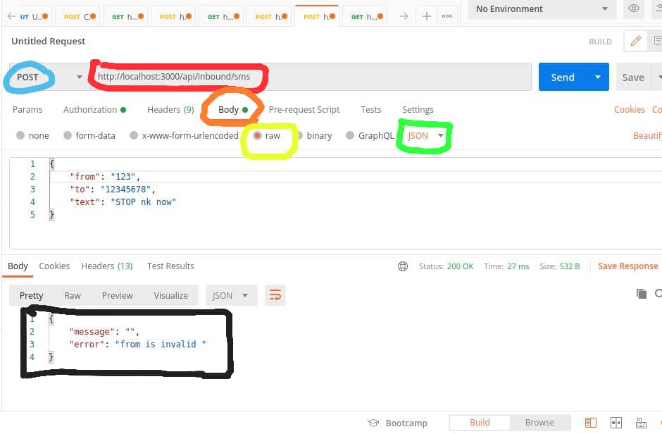
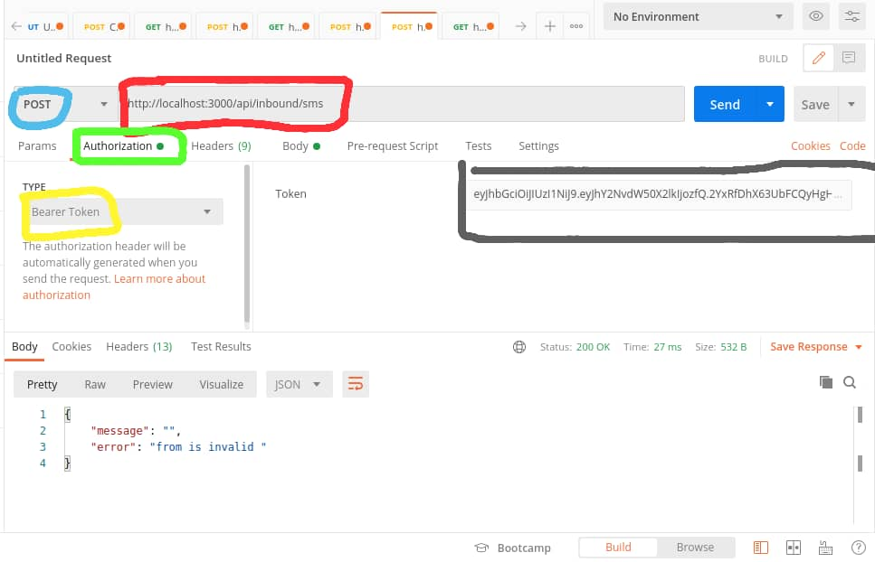

# MY MONEY KARMA
Welcome to the Backend API assignment!
It contains the following API endpoints

# Add a new account to the database endpoint: 
  API endpoint to *Create a new account* 
  > A successful API request will
   - return HTTP 200 OK status
   - add a new account to the database and populate it as a json object in the response body.

  > An unsuccessful API request will 
   - return HTTP 200 OK status
   - Populate an error message *Account already exists* in the response body if username matches an already existing account
   - Populate an error message *Account not created* in the response body 

# Add login to an existing account endpoint: 
  API endpoint to *Create a new account* 
  > A successful API request will
   - return HTTP 200 OK status
   - return the user with a JWT token.
  
  > An unsuccessful API request will 
   - return HTTP 200 OK status
   - Populate an error message *Invalid username or password* in the response body

# Add phone number to an a particular account
  API endpoint to *Create a new phone number* 
  > A successful API request will
   - return HTTP 200 OK status
   - add a new phone number to the database and populate it as a json object in the response body.
  
  > An unsuccessful API request will 
   - return HTTP 200 OK status
   - Populate an error message *corresponding to the error encountered* in the response body 

# Get all numbers endpoint:
  API endpoint to *Fetch all numbers* in the store
  > A successful API request will
   - return HTTP 200 OK status
   - fetch all items in the store and populate it as a json object in the response body
  
  > An unsuccessful API request will return HTTP 404 Nt Found status

# Send inbound sms endpoint: 
  API endpoint to *sends inbound messages* in the store
  > A successful API request will
   - return HTTP 200 OK status
   - Populate error message as a json object in the response body if there are errors.
   - Populate *inbound sms ok*  as a json object in the response body if everything is ok.
  
  > An unsuccessful API request will 
   - return HTTP 401 Unauthorized status
   - Populate an error message *Not authorized* in the response body

# Send inbound sms endpoint: 
  API endpoint to *sends outbound messages* in the store
  > A successful API request will
   - return HTTP 200 OK status
   - Populate error message as a json object in the response body if there are errors.
   - Populate *outbound sms ok*  as a json object in the response body if everything is ok.
  
  > An unsuccessful API request will 
   - return HTTP 401 Unauthorized status
   - Populate an error message *Not authorized* in the response body

<p align="center">
    <a href="https://ruby-doc.org/core-2.7.1/Array.html" alt="Ruby">
        </a>
    <a href="https://rubyonrails.org/" alt="Rails">
        </a>
    <a href="https://rspec.info/documentation/" alt="Rspec-rails">
        </a>
    <a href="https://rubygems.org/gems/pg/versions/0.18.4?locale=es" alt="Postgresql">
        </a>
</p>

<p align="center">
    <br />
    <a href="https://github.com/Kingobaino1/Backend-api-assignment"><strong>Explore this project »</strong></a>
    <br />
    <br />&#10023;
    <a href="#Prerequisites">Prerequisites</a> &#10023;
    <a href="#Getting-Started">Getting Started</a> &#10023;
    <a href="#Usage">Usage</a> &#10023;
    <a href="#Run-tests">Run tests</a> &#10023;
    <a href="#Deployment">Deployment</a> &#10023;
    <a href="#Author">Author</a> &#10023;
    <a href="#Show-your-support">Show your support</a> &#10023;
    <a href="#License">License</a> &#10023;
    <a href="#Feedbacks">Feedbacks</a> &#10023;
    <a href="https://github.com/Kingobaino1/merchandise-store/issues">Report Bug</a>    &#10023;

</p>

<br/>

### Prerequisites

- Ruby 2.7.1 must be installed on your machine.
- Text Editor
- Rails 6.0.4
- Redis 5.0.7
- JWT
- Postgres: >=12.9
- Git
- End-to-End Testing with [RSpec](https://rspec.info/)
- Faker
- Factory Bot,
- Database Cleaner,
- Shoulda Matchers.

### Installation
Install the following software to enable you run the code:
- Ruby 2.7.1 must be installed on your machine.
- Text Editor of your choice
- Rails 6.0.4
- Redis 5.0.7

## Getting Started
1. Open Terminal.
2. Navigate to your desired location to download the contents of this repository.
3. Copy and paste the following code into the Terminal :
   `git clone git@github.com:Kingobaino1/Backend-api-assignment.git`
4. Run `cd Backend-api-assignment`
5. Install the needed gems `bundle install`
6. Next, create and migrate the database: 
   Run`rails db:create` and `rails db:migrate`
7. Seed the database `rails db:seed`
8. Visit `jwt.io` to generate a JWT key. Save the key as `SESSION_SECRET`
9. Create a `.env` file in the root folder and paste the JWT key. The format is `SESSION_SECRET=your_key`
10. Start the rails server run `rails server`
11. Start the redis server run `redis-server`


### Usage

While the rails and redis servers are still on, open Postman and follow these instructions:
# Add a new account to the database endpoint:
 1. paste this url: `http://localhost:3000/api/v1/accounts` in *Enter request ULR* tab
  2. select `POST`
  3. select `Body`
  4. select `raw` and enter `{ "username": "user_name", "password": "password" }` 
  5. select `JSON`
  6. click `send`
  7. copy the `jwt token`



<p align='center'><small>Create user with jwt</small></p>

# Login to an account to endpoint:
  1. paste this url: `http://localhost:3000/api/v1/login` in *Enter request ULR* tab
  2. select `POST`
  3. select `Body`
  4. select `raw` and enter `{ "username": "account_user_name", "password": "account_password" }` 
  5. select `JSON`
  6. click `send`
  7. copy the `jwt token`

# Add a new phone number to an account in the database endpoint:
 1. paste this url: `http://localhost:3000/api/v1/phone_numbers` in *Enter request ULR* tab
  2. select `POST`
  3. select `Body`
  4. select `raw` and enter `{ "account_id": "user_account", "number": "number" }` 
  5. select `JSON`
  6. click `send`

# Send an inbound sms a endpoint:
  1. paste this url: `http://localhost:3000/api/inbound/sms` in *Enter request ULR* tab
  2. select `POST`
  3. click on `Authorization`
  4. select `Bearer Token` and past the `Token` generated from account creation or login of the user account you want to use.
  3. select `Body`
  4. select `raw` and enter `{ "from": "num1", "to": "num2", "text": "text_here" }` 
  5. select `JSON`
  6. click `send`
  7. test for different test cases by altering the values

# Send an outbound sms a endpoint:
  1. paste this url: `http://localhost:3000/api/outbound/sms` in *Enter request ULR* tab
  2. select `POST`
  3. click on `Authorization`
  4. select `Bearer Token` and past the `Token` generated from account creation or login of the user account you want to use.
  3. select `Body`
  4. select `raw` and enter `{ "from": "num1", "to": "num2", "text": "text_here" }` 
  5. select `JSON`
  6. click `send`
  7. test for different test cases by altering the values

<p align='center'><small>inbound/outbound sms</small></p>


<p align='center'><small>inbound/outbound sms</small></p>

# Get the list of phone numbers:
  1. paste this url: `http://localhost:3000/api/v1/phone_numbers` in *Enter request ULR* tab 
  2. select `GET`
  3. click `send`


### Run unit tests

In order to test, just type this command:

```
bundle exec rspec
```

I configured the RSpec test framework with Factory Bot, Database Cleaner, Shoulda Matchers, and Faker.

### Deployment

To deploy this app to Heroku follow the steps below

Install the [Heroku CLI](https://devcenter.heroku.com/articles/heroku-cli)

After that type the command below into your terminal.

```
heroku create
```

```
git push heroku main:buil-app
```

Finally, run the command to create your database Heroku

```
heroku run rails db:migrate
```

## Author 

👤 **Kingsley Ibeh**

- Github: [@githubhandle](https://github.com/Kingobaino1)
- Twitter: [@twitterhandle](https://twitter.com/ibehkingso)
- Linkedin: [linkedin](https://www.linkedin.com/in/kingsley-ibeh)


## Show your support

Give a ⭐️ if you like this project!


## License

This project is [MIT](LICENSE) licensed.
